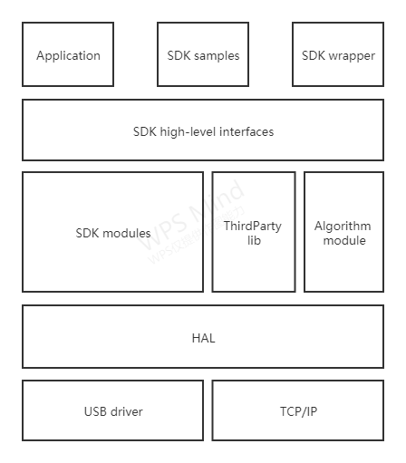

### API Introduction

libsmartereye2 API 主要提供接口对双目相机进行操作并获取图像数据流。

SDK的API结构主要分为两层，上层结构和下层接口。
* 上层接口(High-Level API)位于include目录下，提供SDK最基础的功能，对下层接口进行封装，隐藏了代码实现细节；
* 下层接口(SDK Modules)位于src目录下，是SDK功能的具体实现。

### 介绍

上层应用接口被抽象为Pipeline、Streaming、Sensor、Device、Processing等5类接口。接口部分定义与具体实现进行隔离，保证接口部分稳定性。

#### Pipeline
* Pipeline: SDK主要接口，用于与设备建立连接，并获取图像等数据；
* PipelineConfig: 用于配置pipeline，指定设备类型和数据图像类型；
* PipelineProfile: 描述当前已连接设备和已请求图像的相关信息。

#### Streaming
数据接口，所有的传感器输出数据以数据流方式管理，可以对数据进行读取、处理等操作。
* StreamProfile: 描述一种图像数据流的相关信息，包括帧ID、格式、帧率等信息。

#### Sensor
实现了对传感器的抽象，可以控制传感器数据的输出、查询等功能。
* Sensor: 设备上各种传感器的抽象，目前只包含双目相机。

#### Device
实现了对设备的功能控制，可以实现设备的升级、标定等功能。
* Device: 设备的抽象，管理一个或多个Sensor。

#### Processing
数据处理接口，可以通过Processing接口定义多种数据处理方式。
* Filter: 内部接收图像后，对图像进行二次处理。包括彩色图像转换，深度图渲染，点云转换等。
